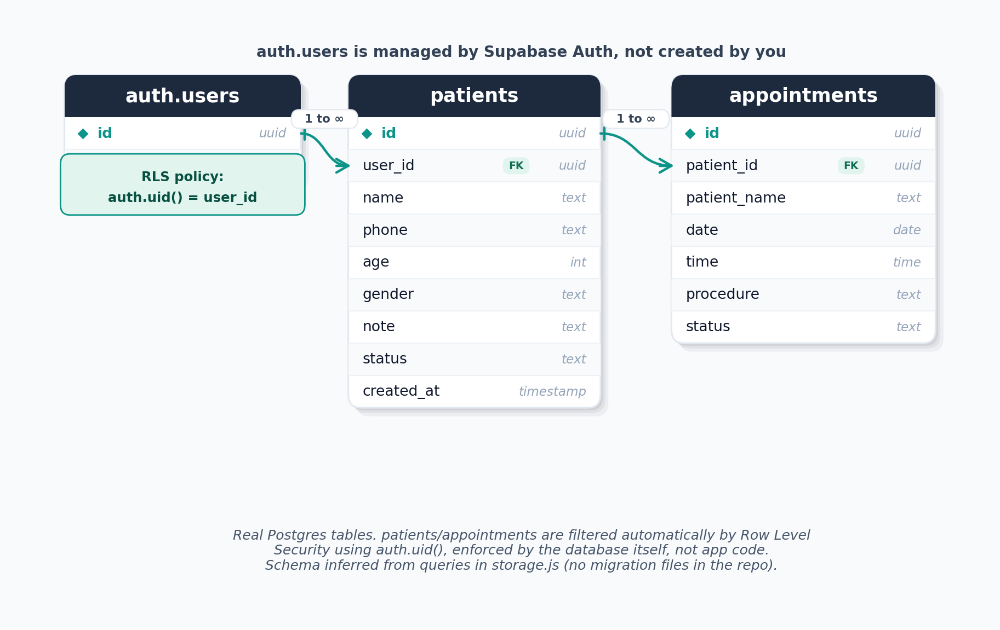

# Dental Clinic Management System (PMS) — Supabase Edition

A **staff-only PMS (Patient Management System)** that replaces paper records and Excel sheets for dental clinics. **Receptionists** and **doctors** manage **patients** and **appointments** from one dashboard.

    

**Live demo:** [clinic-webapp-supabase.vercel.app](https://clinic-webapp-supabase.vercel.app/)

This is the **Supabase** version, real accounts and a shared Postgres database. For the simpler version with no backend, see the [main branch](https://github.com/omarahmed321/myfinaldentistproject) ([live demo](https://clinic-saas-webapp.vercel.app/login)).

---

## Table of Contents

- [About](#about)
- [Data Storage](#data-storage)
- [Features](#features)
- [Tech Stack](#tech-stack)
- [Run Locally](#run-locally)
- [Project Structure](#project-structure)

---

## About

Small dental clinics often manage patients and appointments on paper or in Excel, which leads to lost files, double bookings, and no easy way to search a patient's history. This app gives the front desk one simple place to do all of that, backed by a real database instead of the browser.

## Data Storage

This version replaces local storage with **Supabase**: a hosted Postgres database plus real authentication. Each doctor signs up with an email and password, and **Row Level Security (RLS)** on the `patients` and `appointments` tables makes sure a doctor only ever sees their own data, enforced by the database itself, not just the app code. Auth state is checked in Next.js middleware before any page loads, so the same route protection from the local storage version still applies here.



> The `patients` and `appointments` tables live in Postgres and are filtered per-doctor by **Row Level Security**. `auth.users` is managed by Supabase Auth. Schema inferred from the queries in `storage.js` — there are no migration files in the repo.

## Features

- **Login / Sign Up**: real email and password accounts via Supabase Auth
- **Dashboard**: quick overview of clinic activity
- **Patients List**: searchable, paginated table of all patients
- **Add / Edit Patient**: name, phone, age, gender, and a **note** field (for allergies or medical conditions)
- **Patient Details**: full record view for a single patient
- **Appointments**: book and view appointments by date and time

## Tech Stack

- **Framework:** [Next.js](https://nextjs.org)
- **UI:** React + [Tailwind CSS](https://tailwindcss.com)
- **Language:** JavaScript
- **Backend:** [Supabase](https://supabase.com) (Postgres, Auth, Row Level Security)

## Run Locally

### Prerequisites

- Node.js installed
- npm (or yarn / pnpm / bun)
- A Supabase project (free tier works), for its URL and public key

### Installation

```bash
# clone the repo and switch to the supabase branch
git clone https://github.com/omarahmed321/myfinaldentistproject.git
cd myfinaldentistproject
git checkout supabase

# install dependencies
npm install
```

Create a `.env.local` file in the project root with your own Supabase project values:

```
NEXT_PUBLIC_SUPABASE_URL=your-project-url
NEXT_PUBLIC_SUPABASE_PUBLISHABLE_KEY=your-anon-public-key
```

```bash
# run the dev server
npm run dev
```

Open [http://localhost:3000](http://localhost:3000) to see it running.

## Project Structure

```
myfinaldentistproject/ (supabase branch)
├── public/                 # icons and static assets
├── src/
│   ├── app/
│   │   ├── (dashboard)/
│   │   │   ├── addpatient/     # add / edit patient form
│   │   │   ├── appointments/   # weekly appointments view
│   │   │   ├── patientdetail/  # single patient view + booking
│   │   │   ├── patients/       # patients list
│   │   │   ├── layout.jsx      # dashboard layout (nav + sidebar)
│   │   │   └── page.jsx        # dashboard home
│   │   ├── login/
│   │   ├── signup/
│   │   └── layout.tsx
│   ├── components/         # NavBar, SideBar, and other shared UI
│   └── utils/
│       ├── storage.js      # Supabase queries (patients, appointments, auth)
│       ├── supabase/
│       │   ├── client.js   # browser Supabase client
│       │   └── server.js   # server-side Supabase client
│       └── pagenation.js
├── src/proxy.js             # middleware, checks Supabase auth session
├── package.json
└── tsconfig.json
```