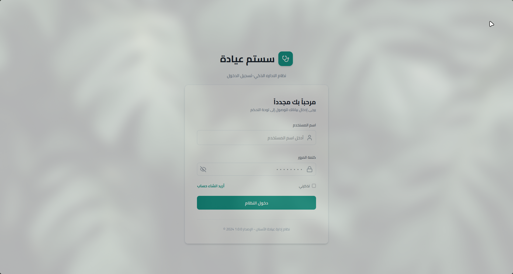
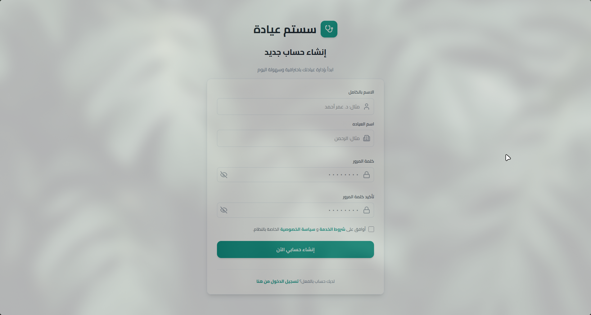
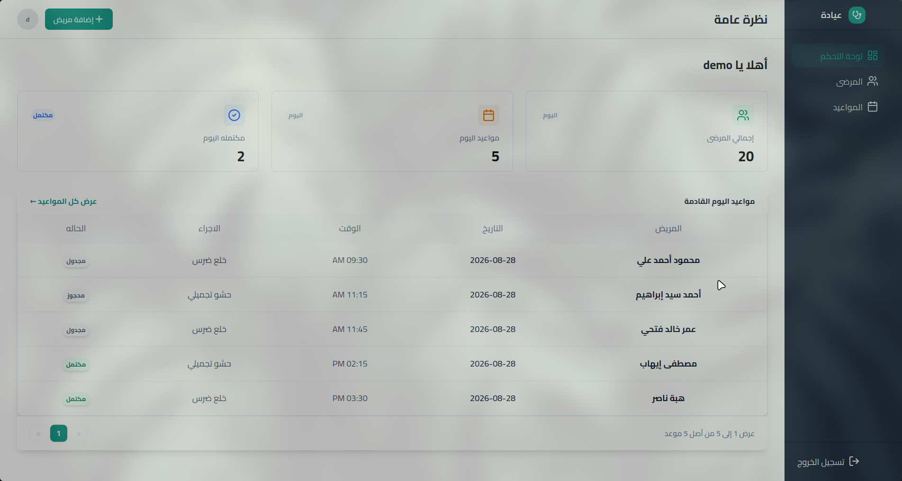
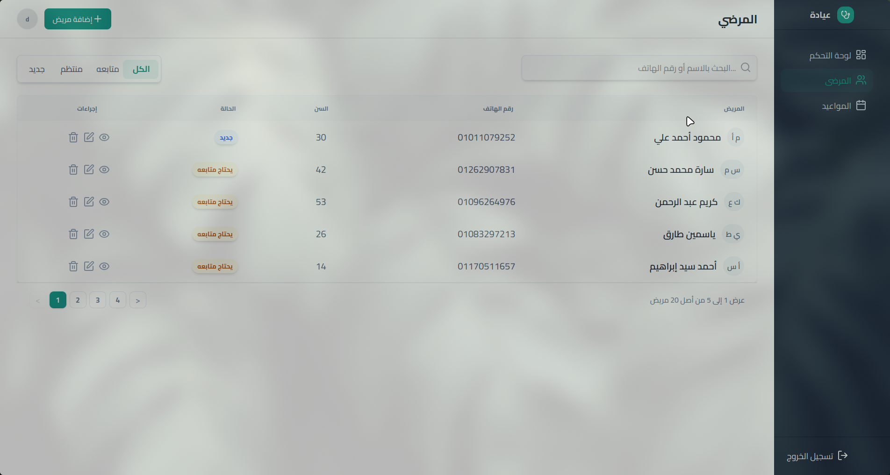
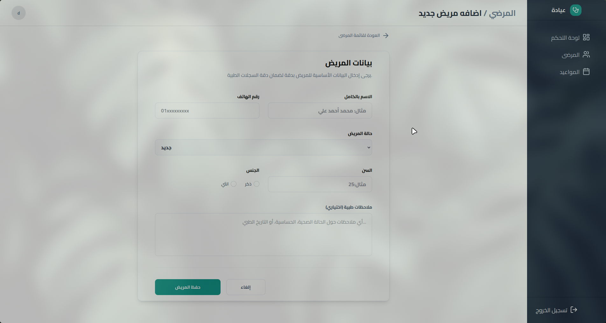
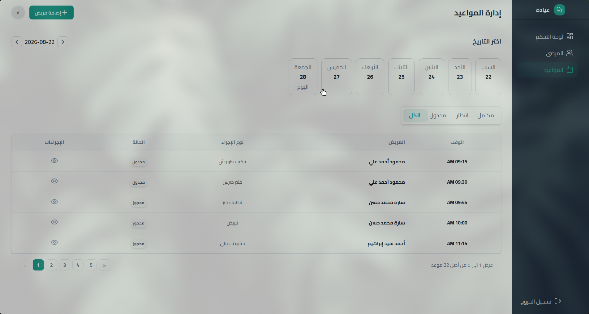
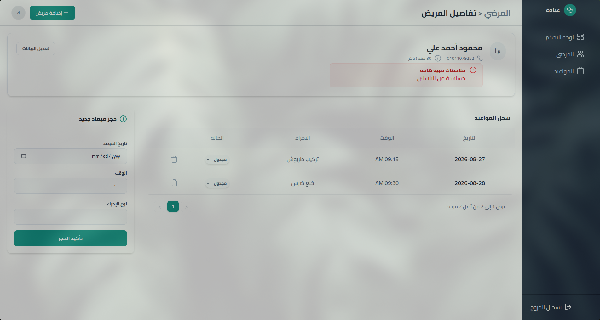

# Dental Clinic Management System (PMS)

A **staff-only PMS (Patient Management System)** that replaces paper records and Excel sheets for dental clinics. **Receptionists** and **doctors** manage **patients** and **appointments** from one dashboard.

   

**Live demo:** [clinic-saas-webapp.vercel.app](https://clinic-saas-webapp.vercel.app/login)

This is the **local storage** version, data lives only in your own browser. For the version with a real backend, see the [Supabase branch](https://github.com/omarahmed321/myfinaldentistproject/tree/supabase) ([live demo](https://clinic-webapp-supabase.vercel.app/)).

---

## Table of Contents

- [About](#about)
- [Data Storage](#data-storage)
- [Features](#features)
- [Screenshots](#screenshots)
- [Tech Stack](#tech-stack)
- [Run Locally](#run-locally)
- [Project Structure](#project-structure)

---

## About

Small dental clinics often manage patients and appointments on paper or in Excel, which leads to lost files, double bookings, and no easy way to search a patient's history. This app gives the front desk one simple place to do all of that.

## Data Storage

This app stores all data in the **browser's local storage**. There is no shared database. Data is private to whoever is using the browser, and it stays only on that device. Local storage was used to keep the project **self-contained**, no backend setup or hosting needed to run it.

## Features

- **Login / Sign Up**: staff account creation and login
- **Dashboard**: quick overview of clinic activity
- **Patients List**: searchable, paginated table of all patients
- **Add / Edit Patient**: name, phone, age, gender, and a **note** field (for allergies or medical conditions)
- **Patient Details**: full record view for a single patient
- **Appointments**: book and view appointments by date and time

## Screenshots

**Login**



**Sign Up**



**Dashboard**



**Patients List**



**Add Patient**



**Appointments**



**Patient Details**



## Tech Stack

- **Framework:** [Next.js](https://nextjs.org)
- **UI:** React + [Tailwind CSS](https://tailwindcss.com)
- **Language:** JavaScript
- **Storage:** Browser local storage (no backend database)

## Run Locally

### Prerequisites

- Node.js installed
- npm (or yarn / pnpm / bun)

### Installation

```bash
# clone the repo
git clone https://github.com/omarahmed321/myfinaldentistproject.git
cd myfinaldentistproject

# install dependencies
npm install

# run the dev server
npm run dev
```

Open [http://localhost:3000](http://localhost:3000) to see it running.

## Project Structure

```
myfinaldentistproject/
├── public/                 # icons and static assets
├── src/
│   ├── app/
│   │   ├── (dashboard)/
│   │   │   ├── addpatient/     # add / edit patient form
│   │   │   ├── appointments/   # weekly appointments view
│   │   │   ├── patientdetail/  # single patient view + booking
│   │   │   ├── patients/       # patients list
│   │   │   ├── layout.jsx      # dashboard layout (nav + sidebar)
│   │   │   └── page.jsx        # dashboard home
│   │   ├── login/
│   │   ├── signup/
│   │   └── layout.tsx
│   ├── components/         # NavBar, SideBar, and other shared UI
│   └── utils/
│       ├── storage.js      # local storage read/write functions
│       └── pagenation.js
├── package.json
└── tsconfig.json
```